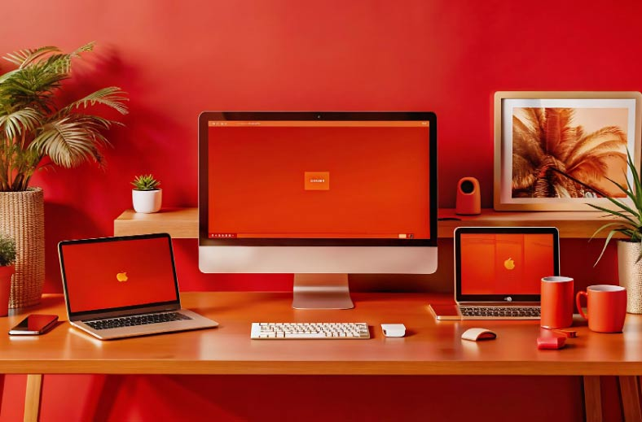

# Espacio de trabajo: Productividad y bienestar en la empresa

## Impacto del espacio de trabajo en la productividad

Un espacio de trabajo bien diseñado, cómodo y ergonómico no solo mejora la experiencia laboral de los empleados, sino que también genera un impacto positivo en la productividad y el bienestar de la organización en su conjunto:

- **Aumento de la productividad:** Un entorno de trabajo agradable y motivador fomenta la concentración, la creatividad y el desempeño de los trabajadores, lo que se traduce en un aumento de la productividad y la eficiencia.

- **Reducción del estrés y la fatiga:** Un espacio ergonómico y adaptado a las necesidades de los trabajadores ayuda a prevenir el estrés físico y la fatiga, lo que se traduce en una mejor salud y una mayor disposición para el trabajo.

- **Mejora del estado de ánimo y la motivación:** Un entorno de trabajo positivo y estimulante contribuye a mejorar el estado de ánimo, la motivación y el compromiso de los trabajadores, lo que genera un ambiente laboral más dinámico y colaborativo.

- **Reducción del absentismo laboral:** Un espacio de trabajo saludable y seguro ayuda a reducir el absentismo laboral por motivos de salud, lo que se traduce en un menor impacto en la producción y los costos para la empresa.

- **Mejora de la imagen y reputación de la empresa:** Un espacio de trabajo moderno, cómodo y bien diseñado proyecta una imagen corporativa positiva y atractiva, lo que puede mejorar su reputación y atraer a talento humano de alto nivel.

## Implementos esenciales para un espacio de trabajo cómodo

Para crear un espacio de trabajo cómodo y funcional, es necesario contar con los implementos adecuados que brinden soporte y comodidad a los trabajadores:

- **Mobiliario ergonómico:** Sillas ajustables, escritorios de altura regulable, soportes para monitores y teclados son esenciales para mantener una postura correcta y prevenir lesiones musculoesqueléticas.

- **Iluminación adecuada:** Una iluminación natural y artificial adecuada es fundamental para evitar la fatiga visual y mejorar la concentración.

- **Temperatura y ventilación:** Un ambiente con temperatura regulable y ventilación adecuada contribuye al confort y bienestar de los trabajadores.

- **Aislamiento acústico:** Un espacio de trabajo con un buen aislamiento acústico reduce el ruido ambiental y permite una mejor concentración.

- **Elementos decorativos:** Incorporar elementos decorativos como plantas, cuadros o fotografías puede crear un ambiente más agradable y estimulante.

## Consejos de como organizar tu espacio de trabajo

- **Evaluar las necesidades:** Es importante realizar una evaluación de las necesidades de los trabajadores para identificar los aspectos que requieren mayor atención en el espacio de trabajo.

- **Personalizar el espacio:** Permitir a los trabajadores personalizar su espacio de trabajo con elementos personales puede aumentar su sentido de pertenencia y mejorar su comodidad.

- **Promover el orden y la organización:** Un espacio de trabajo ordenado y organizado facilita la concentración y reduce el estrés.

- **Fomentar el movimiento:** Incentivar a los trabajadores a tomar pausas activas para realizar estiramientos o caminar puede ayudar a prevenir la fatiga física y mental.

- **Promover la interacción social:** Crear espacios comunes donde los trabajadores puedan interactuar y socializar puede fortalecer el trabajo en equipo y mejorar el ambiente laboral.

## Recomendaciones para las empresas

- **Invertir en la creación de espacios de trabajo cómodos:** La inversión en la adecuación y equipamiento del espacio de trabajo se traduce en una mayor productividad, bienestar y satisfacción de los trabajadores, lo que genera un retorno positivo para la empresa.

- **Involucrar a los trabajadores en el diseño del espacio:** Consultar a los trabajadores sobre sus necesidades y preferencias en cuanto al espacio de trabajo puede generar un mayor sentido de pertenencia y compromiso con el entorno laboral.

- **Adaptar el espacio de trabajo a las diferentes necesidades:** Considerar las necesidades específicas de los diferentes grupos de trabajadores, como personas con discapacidades o aquellos que trabajan con equipos específicos.

- **Mantener el espacio de trabajo limpio y ordenado:** Un espacio de trabajo limpio y ordenado no solo es más agradable, sino que también contribuye a una mayor productividad y seguridad.

El espacio de trabajo no es solo un lugar físico donde se realizan tareas, sino que se convierte en un oasis de productividad y bienestar para los trabajadores. Invertir en la creación de un espacio de trabajo cómodo, ergonómico y funcional genera un impacto positivo en la salud, la motivación y el desempeño de los colaboradores, contribuyendo al éxito y la competitividad de la empresa.
